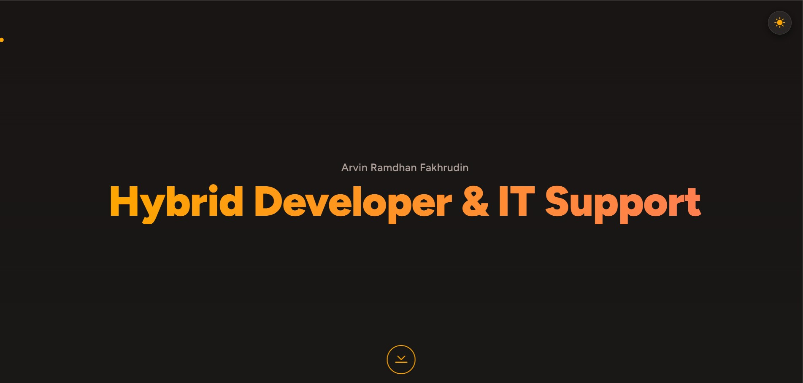

# Arvin Ramdhan Fakhrudin - Hybrid Developer Portfolio


Ini adalah repositori untuk website portofolio personal saya. Proyek ini dibangun sepenuhnya dari awal (vanilla) tanpa menggunakan *framework* CSS atau JS.

Tujuan utama dari portofolio ini adalah untuk mendemonstrasikan keahlian "Hybrid" saya, yang menggabungkan fondasi teknis **IT Support** dengan keterampilan **Modern Web Development**.

**Lihat Langsung:** **[arvindev.netlify.app](https://arvindev.netlify.app)**
*(Ganti dengan link Netlify Anda setelah di-deploy)*

---

### Screenshot Proyek




## ✨ Fitur Unggulan

Portofolio ini lebih dari sekadar halaman statis; ini adalah *showcase* dari apa yang bisa saya bangun.

* **🖥️ Terminal Interaktif:** Sebuah pseudo-terminal fungsional di dalam Bento Grid. Pengunjung dapat mengetik perintah seperti `help`, `about`, `skills`, `contact`, atau `clear` untuk menavigasi profil saya dengan cara yang unik.
* **📜 "Scrollytelling" About Me:** Pengalaman bercerita dinamis yang menggunakan `IntersectionObserver` API. Saat pengunjung men-scroll teks di sebelah kiri, visual di sebelah kanan (yang "sticky") akan berubah (fade-in/out) untuk mencerminkan cerita—bertransisi dari foto profil, ke ikon IT Support, lalu ke ikon Web Dev.
* **🤫 Easter Egg Kode Konami (Desktop):** Sebagai penghormatan kepada budaya *developer*, memasukkan Kode Konami (`↑ ↑ ↓ ↓ ← → ← → B A`) akan memicu efek "Matrix" digital rain yang digambar pada `<canvas>` dan menampilkan pesan tersembunyi.
* **🖱️ Kursor "Morphing" (Desktop):** Kursor *dot* kustom yang berubah bentuk (morphing) secara mulus untuk menyatu dengan tombol, ikon, dan elemen interaktif lainnya saat di-*hover*.
* **🌗 Mode Terang & Gelap:** *Toggle* tema yang *aesthetic* dengan preferensi yang disimpan di `localStorage`.
* **🔄 Konten TABS Dinamis:** Bagian "Experience & Education" diubah menjadi TABS yang bersih untuk menghemat ruang dan meningkatkan UX.
* **📊 Filter Kategori Langsung:** *Skill* dan Sertifikat dapat difilter secara instan berdasarkan kategori tanpa me-load ulang halaman.
* **📱 Desain Fully Responsive:** Didesain *mobile-first* dengan *layout* yang disesuaikan (misalnya, *scrollytelling* dinonaktifkan di *mobile* untuk UX yang lebih baik).

## 🛠️ Tumpukan Teknologi (Tech Stack)

Proyek ini sengaja dibangun secara *vanilla* untuk mendemonstrasikan pemahaman fundamental yang kuat.

* **HTML5:** Semantik, terstruktur, dan aksesibel.
* **Vanilla CSS3:**
    * Desain *layout* modern (CSS Grid, Flexbox).
    * *Theming* dinamis (CSS Variables).
    * Animasi dan Transisi Kustom.
* **Vanilla JavaScript (ES6+):**
    * Manipulasi DOM penuh.
    * **Intersection Observer API** (untuk *scrollytelling*).
    * **Canvas API** (untuk efek *Matrix*).
    * Manajemen *Event Listener* yang kompleks (untuk Kursor, Terminal, Kode Konami, TABS, dll.).
* **AOS (Animate on Scroll):** *Library* ringan untuk animasi *fade-in* saat *scroll*.
* **Bootstrap Icons:** Untuk *glyph* yang bersih dan konsisten.
* **Deployment:** Di-hosting di **Netlify** (atau **Vercel**) dengan *continuous deployment* dari GitHub.

## 🚀 Menjalankan Secara Lokal

Tidak diperlukan *build step* atau instalasi *package*.

1.  *Clone* repositori ini:
    ```sh
    git clone [https://github.com/ARVIN1006/Personal-Website.git](https://github.com/ARVIN1006/Personal-Website.git)
    ```

2.  Masuk ke direktori proyek:
    ```sh
    cd Personal-Website
    ```

3.  Cukup buka file `index.html` di *browser* favorit Anda.
    *(Tips: Gunakan ekstensi "Live Server" di VS Code untuk pengalaman terbaik).*
